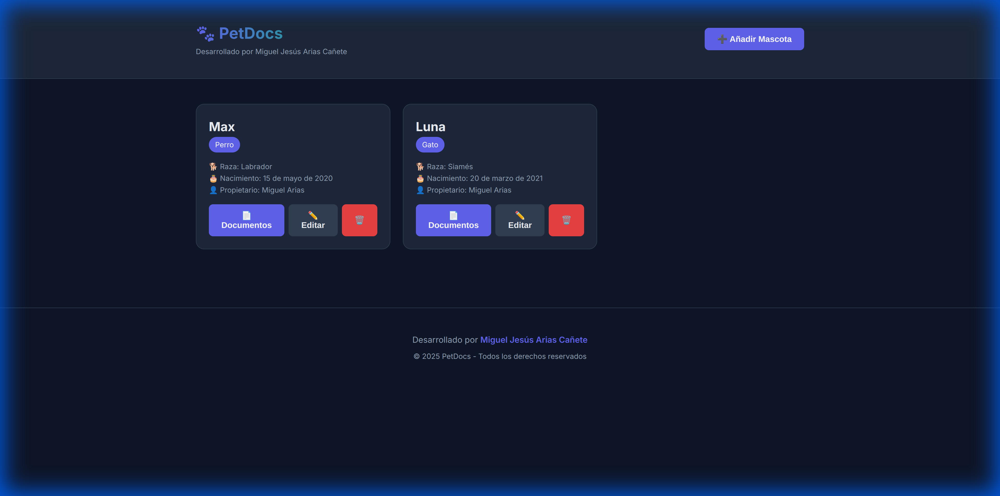
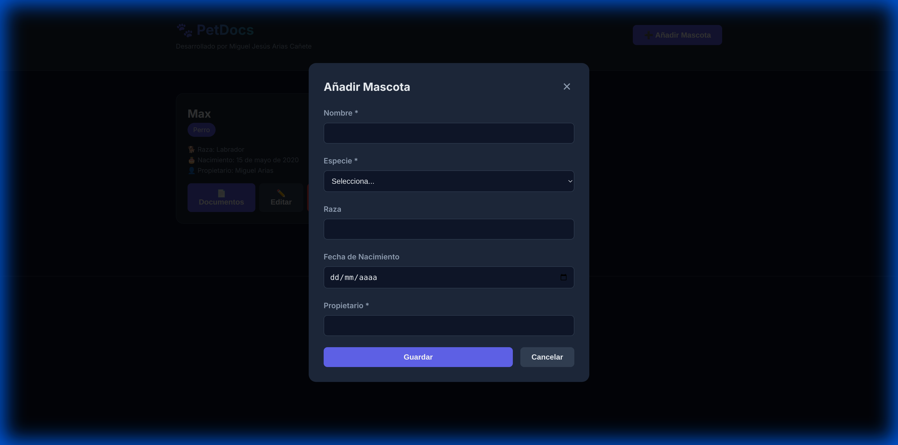
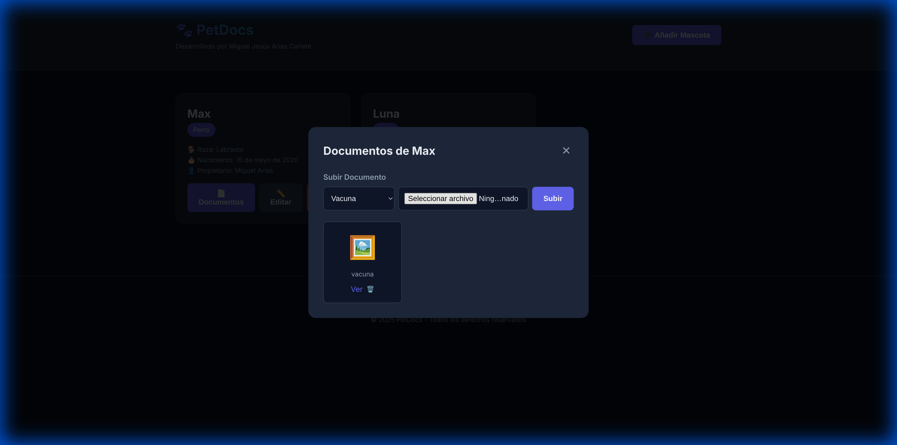

# PetDocs - Gestión de Documentos de Mascotas


**Desarrollado por Miguel Jesús Arias Cañete**

## 🌐 Demo en Vivo

**[🚀 Ver aplicación en funcionamiento →](https://petdocs-miguel.lovestoblog.com)**

Aplicación web para digitalizar y gestionar documentos de mascotas (vacunas, certificados médicos, etc.) accesible desde cualquier dispositivo.

## 📸 Capturas de Pantalla

### Pantalla Principal


### Añadir Mascota


### Gestión de Documentos


## ✨ Características Principales

- 🐾 Gestión completa de mascotas (crear, editar, eliminar)
- 📄 Subida de documentos (PDF e imágenes)
- 🔍 Organización por tipo de documento
- 📱 Diseño responsive (móvil, tablet, desktop)
- 🎨 Interfaz moderna con dark theme
- 🔒 Seguridad con PDO y prepared statements

## Tecnologías Utilizadas
- **Frontend**: HTML5, CSS3, JavaScript (Vanilla)
- **Backend**: PHP 7.4+
- **Base de Datos**: MySQL
- **Hosting**: InfinityFree (gratuito)

## Estructura del Proyecto
```
PetDocs/
├── public/              # Archivos públicos (frontend)
│   ├── index.html
│   ├── css/style.css
│   ├── js/app.js
│   └── uploads/         # Documentos subidos
├── api/                 # Backend PHP
│   ├── config.php       # Configuración BD
│   ├── pets.php         # API de mascotas
│   └── documents.php    # API de documentos
└── database/
    └── schema.sql       # Esquema de la BD
```

## Instalación en InfinityFree

### 1. Crear Base de Datos
1. Accede al panel de control de InfinityFree
2. Ve a "MySQL Databases" → "Create Database"
3. Crea una base de datos (ej: `petdocs_db`)
4. Anota las credenciales (nombre, usuario, contraseña, host)

### 2. Importar Esquema
1. Abre phpMyAdmin desde el panel de InfinityFree (botón "Manage" en MySQL Databases)
2. Selecciona tu base de datos
3. Ve a la pestaña "SQL"
4. Copia y pega el contenido de `database/schema.sql`
5. Haz clic en "Go" (Ejecutar)

### 3. Configurar Conexión

**⚠️ IMPORTANTE: Seguridad**

El archivo `api/config.php` contiene credenciales sensibles y **NO debe subirse a Git**.

1. Copia el archivo de ejemplo:
   ```bash
   cp api/config.example.php api/config.php
   ```

2. Edita `api/config.php` con tus credenciales:

```php
define('DB_HOST', 'localhost');        // Host de 000WebHost/InfinityFree
define('DB_NAME', 'tu_base_de_datos'); // Nombre de tu BD
define('DB_USER', 'tu_usuario');       // Usuario de la BD
define('DB_PASS', 'tu_contraseña');    // Contraseña de la BD
```

3. El archivo `config.php` está en `.gitignore` para proteger tus credenciales

### 4. Subir Archivos
1. Usa el File Manager de InfinityFree o un cliente FTP
2. Sube todo el contenido de la carpeta `public/` a `htdocs/`
3. Sube la carpeta `api/` al mismo nivel que `htdocs/`

### 5. Permisos
Asegúrate de que la carpeta `public/uploads/` tenga permisos de escritura (777).

## Uso de la Aplicación

### Gestión de Mascotas
- **Añadir**: Haz clic en "Añadir Mascota" y completa el formulario
- **Editar**: Haz clic en "Editar" en la tarjeta de la mascota
- **Eliminar**: Haz clic en el icono de papelera (⚠️ elimina también sus documentos)

### Gestión de Documentos
1. Haz clic en "Documentos" en la tarjeta de una mascota
2. Selecciona el tipo de documento (vacuna, certificado, etc.)
3. Elige el archivo (PDF o imagen)
4. Haz clic en "Subir"

## Características
- ✅ Diseño responsive (móvil, tablet, desktop)
- ✅ Subida de archivos (PDF e imágenes)
- ✅ API REST con PHP
- ✅ Base de datos MySQL con relaciones
- ✅ Interfaz moderna con dark mode

## Próximas Mejoras
- [ ] Autenticación de usuarios
- [ ] Búsqueda y filtros
- [ ] Recordatorios de vacunas
- [ ] PWA (instalable en móvil)

## Licencia
Proyecto desarrollado por Miguel Jesús Arias Cañete - 2025
